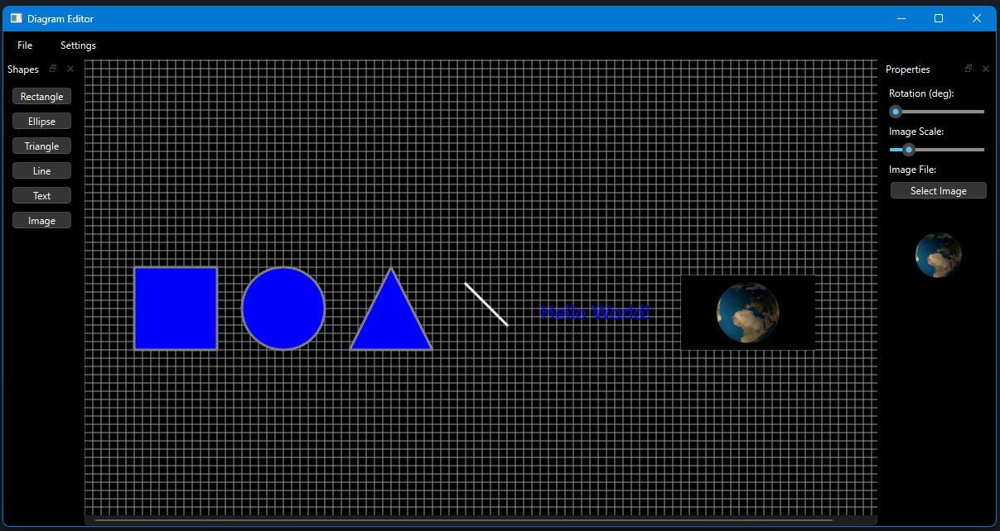

# Diagram Editor Tool

Diagram editor in Python and PyQt6

Features:
- File Menu
    - New
    - Open
    - Save
    - Print
    - Exit
- Settings Menu
    - Toggle Grid
    - Toggle Theme
    - Set Rotation Snap
- Rectangle, Ellipse, Triange Appearance
    - Move
    - Resize Width
    - Resize Height
    - Rotate
    - Fill Color
    - Border Color
    - Border Width

- Text Appearance
    - Move
    - Rotate
    - Text Color
    - Font
    - Font Size

- Line Appearance
    - Move
    - Rotate
    - Line Color
    - Line Width
    - Line Style
    - Line Cap

- Image Appearance
    - Move
    - Rotate
    - Scale
    - Select Image from file

